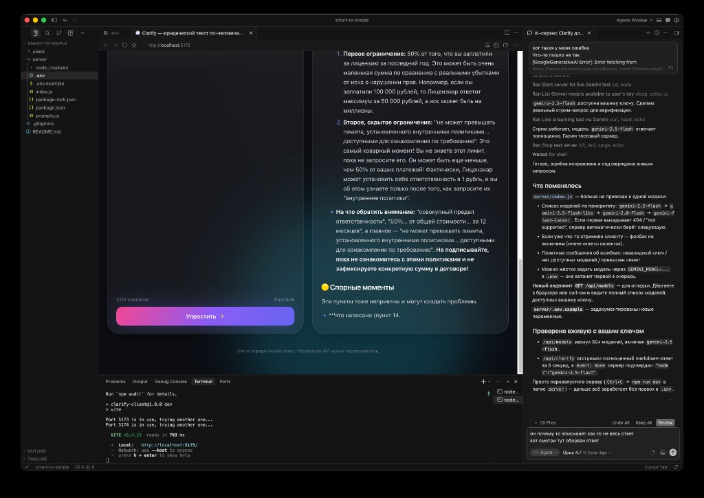

<div align="center">

# 📜 Clarify

### Юридический текст по-человечески

Web-приложение, которое превращает «канцелярский» язык договоров и оферт в понятные списки действий и рисков. Всё на стороне Gemini — бесплатно и приватно.

[](LICENSE)
[](../../actions)


<br />



</div>

---

## 🪄 Что умеет

- **Три режима разбора** одним кликом:
  - **📝 Краткий пересказ** — суть, главные пункты, что от вас хотят
  - **⚠️ Скрытые риски** — красные флаги, спорные моменты, вердикт
  - **🧒 Объясни как 10-летнему** — простыми словами и бытовыми аналогиями
- **Стриминг ответа в реальном времени** — текст печатается по мере генерации (Server-Sent Events)
- **Drag-and-drop загрузка** `.pdf`, `.docx`, `.txt` — текст вытаскивается прямо в браузере
- **Красивый Markdown-вывод**: заголовки, списки, таблицы, жирный
- **Кнопка «Скопировать»**, skeleton-загрузка, плавные анимации
- **Дружелюбная обработка ошибок**: ключ, лимиты, обрыв ответа, недоступная модель — всё с понятным текстом
- **Автофолбэк моделей**: если основная модель Gemini недоступна вашему ключу, сервер сам перебирает запасные

## 🛠 Стек

| Слой | Технология |
| ---- | ---------- |
| UI | React 18, Vite 5, Tailwind CSS 3 |
| Анимации | Framer Motion |
| Markdown | react-markdown + remark-gfm |
| Парсинг файлов | pdfjs-dist, mammoth |
| Сервер | Node.js, Express 4 |
| AI | Google Gemini 2.5 Flash (бесплатный тариф) |
| Транспорт | Server-Sent Events (SSE) |

## 📁 Структура

```
.
├── client/                # React + Vite UI
│   ├── src/
│   │   ├── App.jsx
│   │   ├── components/    # InputPanel, OutputPanel, ModeSelector, SkeletonLoader
│   │   ├── lib/
│   │   │   ├── api.js          # SSE-парсер на fetch + ReadableStream
│   │   │   └── extractText.js  # PDF/DOCX/TXT → текст в браузере
│   │   └── index.css
│   ├── tailwind.config.js
│   └── vite.config.js     # /api прокси на :3001
│
├── server/                # Express + Gemini proxy
│   ├── index.js           # SSE-эндпоинт /api/clarify
│   ├── prompts.js         # 3 системных промпта
│   └── .env.example
│
├── docs/screenshot.png
└── package.json           # корневой — concurrently запускает оба
```

## 🚀 Быстрый старт

### 1. Получите бесплатный ключ Gemini

Откройте [aistudio.google.com/app/apikey](https://aistudio.google.com/app/apikey) → **Create API key** → скопируйте.

> Бесплатный тариф Gemini 2.5 Flash на момент написания: **1500 запросов/день и 1M токенов/минуту** — для личного использования с большим запасом.

### 2. Клонируйте и установите

```bash
git clone https://github.com/USER/REPO.git
cd REPO
npm run install:all
```

### 3. Пропишите ключ

```bash
cp server/.env.example server/.env
# откройте server/.env и вставьте свой GEMINI_API_KEY
```

### 4. Запустите всё одной командой

```bash
npm run dev
```

- Frontend: [http://localhost:5173](http://localhost:5173)
- Backend: [http://localhost:3001](http://localhost:3001)

Готово. Vite проксирует `/api` на бэк — CORS настраивать не нужно.

<details>
<summary>Запустить сервер и клиент по отдельности</summary>

```bash
# Терминал 1
npm run dev:server

# Терминал 2
npm run dev:client
```

</details>

## 🌐 Деплой с GitHub (Netlify + бэкенд отдельно)

**Важно:** Netlify отдаёт только **статический фронт** (папка `client/dist`). Ваш **Express + SSE** на обычном Netlify-«сайте» не запускается. Поэтому схема такая: **бэкенд на хостинге Node** → **фронт на Netlify** с переменной `VITE_API_BASE_URL`, указывающей на этот бэкенд.

### 1. Поднять API (пример: [Render](https://render.com) — бесплатный tier)

1. Зарегистрируйтесь на Render и подключите репозиторий GitHub.
2. **New → Web Service**, выберите репозиторий Clarify.
3. Настройки:
   - **Root Directory:** `server`
   - **Runtime:** Node
   - **Build Command:** `npm ci` (или оставить пустым, если не требуется)
   - **Start Command:** `node index.js`
4. **Environment → Add Environment Variable:**
   - `GEMINI_API_KEY` = ваш ключ из Google AI Studio  
   - при желании: `PORT` обычно задаёт Render сам — не обязательно
5. Создайте сервис и дождитесь деплоя. Скопируйте публичный URL, например `https://clarify-api-xxxx.onrender.com`.

Альтернатива: [Railway](https://railway.app), [Fly.io](https://fly.io) — логика та же: запуск `node index.js` из папки `server`, те же env.

### 2. Netlify: фронт из GitHub

1. [Netlify](https://app.netlify.com) → **Add new site → Import an existing project** → GitHub → выберите репозиторий.
2. В корне репозитория уже лежит [`netlify.toml`](netlify.toml): Netlify сам подхватит **Base directory** `client`, команду сборки и папку `dist`.
3. **Site configuration → Environment variables** → добавьте:
   - `VITE_API_BASE_URL` = `https://clarify-api-xxxx.onrender.com` (**без** слэша в конце)
4. **Deploy site**. После сборки откройте выданный Netlify-URL — запросы пойдут на ваш бэкенд по HTTPS.

> Если меняете `VITE_API_BASE_URL` после первого деплоя — сделайте **Deploys → Trigger deploy → Clear cache and deploy site**, чтобы Vite пересобрал с новой переменной.

### 3. CORS

На сервере уже подключён `cors()` — запросы с домена Netlify к API на другом домене должны проходить. Если провайдер блокирует — уточните в настройках бэкенда разрешённые origin или оставьте открытый CORS для личного проекта.

Локально по-прежнему: `VITE_API_BASE_URL` не нужен — работает прокси Vite на `http://localhost:3001`.

## ⚙️ Переменные окружения

### Сервер (`server/.env`)

| Переменная | По умолчанию | Описание |
| ---------- | ------------ | -------- |
| `GEMINI_API_KEY` | — | **Обязательно.** Ключ из Google AI Studio |
| `GEMINI_MODEL` | автоподбор | Жёстко зафиксировать модель (например, `gemini-2.5-flash`) |
| `GEMINI_MAX_OUTPUT_TOKENS` | `8192` | Лимит длины ответа. Поднимите для очень длинных разборов (потолок Gemini 2.5 — 65536) |
| `PORT` | `3001` | Порт Express |

### Клиент (локально: `client/.env`, на Netlify: Environment variables)

| Переменная | По умолчанию | Описание |
| ---------- | ------------ | -------- |
| `VITE_API_BASE_URL` | пусто | URL бэкенда **без** слэша в конце. Нужен только в продакшене (Netlify). См. [`client/.env.example`](client/.env.example) |

## 🔌 API

### `GET /api/health`

Статус сервера, наличие ключа, кандидаты-модели.

### `GET /api/models`

Список моделей Gemini, реально доступных вашему ключу. Полезно для отладки.

### `POST /api/clarify`

Главный эндпоинт. Стримит ответ через SSE.

**Request:**

```json
{
  "text": "Настоящим Договором Стороны установили...",
  "mode": "summary"
}
```

`mode` — один из `summary` / `risks` / `eli5`.

**Response (SSE):**

```
event: chunk
data: {"text":"## Суть в одном абзаце\n..."}

event: chunk
data: {"text":"\n\n## Главное по пунктам\n..."}

event: warning
data: {"reason":"MAX_TOKENS","message":"Ответ оборван..."}

event: done
data: {"ok":true,"model":"gemini-2.5-flash","finishReason":"STOP"}
```

`event: warning` шлётся, только если Gemini завершил генерацию по нестандартной причине (`MAX_TOKENS`, `SAFETY`, `RECITATION`, `OTHER`).

## 🧠 Как это работает

```
┌─────────────┐    POST /api/clarify     ┌─────────────┐    streamGenerateContent    ┌──────────┐
│  React UI   │ ───────────────────────▶ │   Express   │ ──────────────────────────▶ │  Gemini  │
│             │ ◀──────── SSE ────────── │   + auth    │ ◀────────── stream ──────── │   2.5    │
└─────────────┘   chunk / warning / done └─────────────┘                              └──────────┘
```

Ключ Gemini никогда не покидает сервер — фронтенд работает только со своим бэком.

## 📜 Системные промпты

Лежат в [`server/prompts.js`](server/prompts.js). Каждый режим — отдельный системный промпт с:

- общими правилами (русский язык, никакого канцелярита, не выдумывать факты),
- задачей режима,
- строгим Markdown-форматом ответа.

Хотите свой режим — добавьте новый ключ в `PROMPTS`, и `MODES` его автоматически подхватит.

## 🛡 Приватность

- Текст уходит **только** в Google Gemini API через ваш ключ
- На сервере ничего не пишется в БД и не логируется (кроме коротких диагностических строк)
- Ключ Gemini хранится исключительно в `server/.env` и не попадает в бандл клиента

## ⚖️ Дисклеймер

Это не юридическая консультация. ИИ может ошибаться, додумывать или упускать важное. Перед подписанием серьёзных документов — покажите их живому юристу.

## 📄 Лицензия

[MIT](LICENSE) — делайте с этим что хотите.

---

<div align="center">

Сделано с любовью к ясности и нелюбовью к канцеляриту.

</div>
